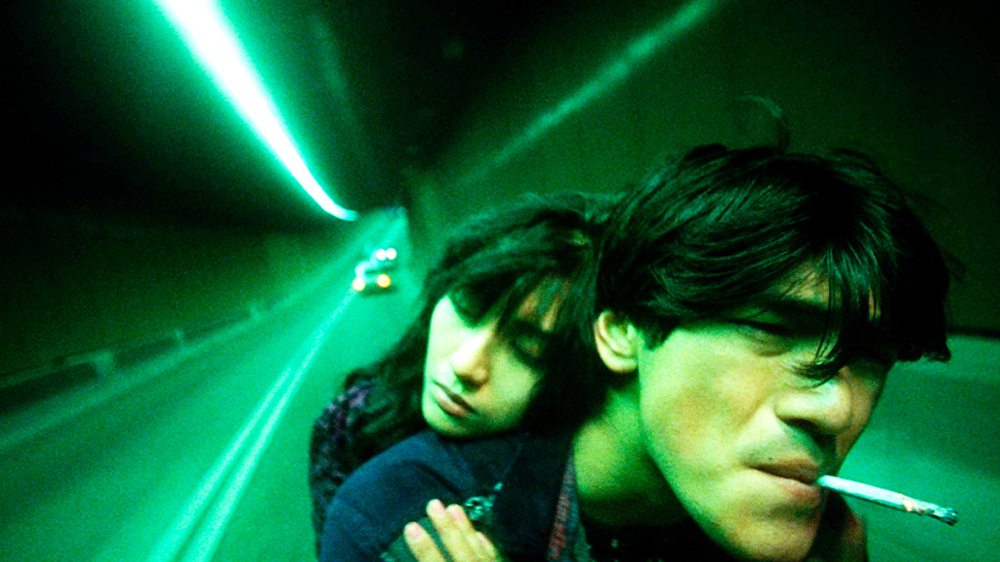
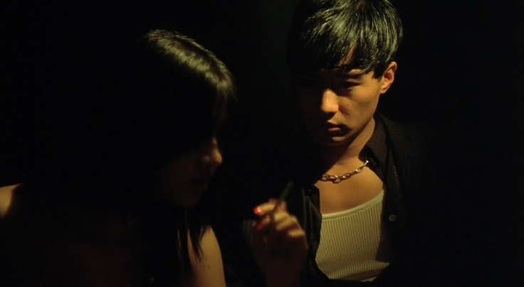

- the wide-angle field of view, close-up shots, blurred/slowed/sped up scenes, and trip-hop soundtrack all create a dizzying effect.
- the cinematography builds a sense of alienation and isolation within the big city. everyone is searching for belonging, but can't seem to find it.
- hong kong at night as a character with its neon lights, seedy locations.
- scenes are beautifully constructed. for example, the final restaurant scene between the hitman and his partner.
- surprisingly funny (e.g., ice cream truck with family)

  
Spoiler

  - did the hitman know his partner put a hit out on him? seems like he knows a lot about her (and she knows a lot about him). so in a way, he knew the only way for her to move on was killing him, and she knew he wanted to die. their final hit as partners.

